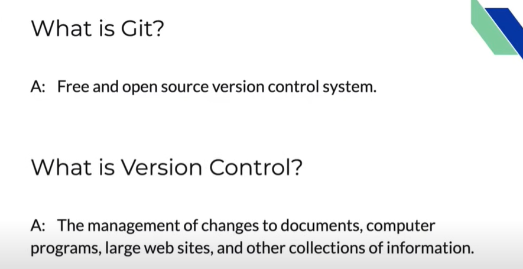
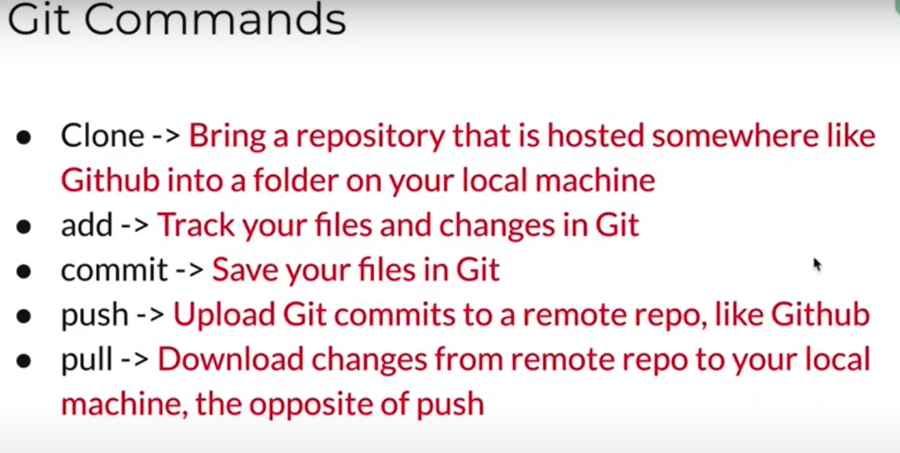
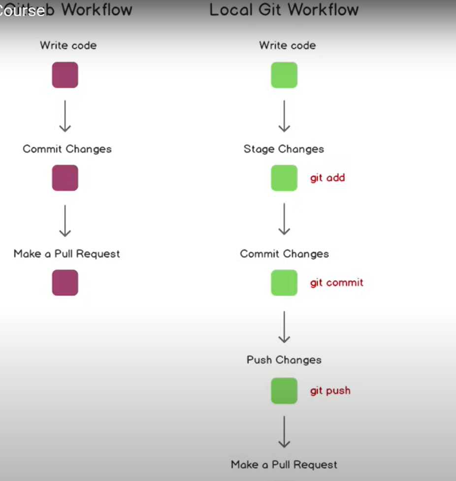

# Git

Git is a **version control system**

## Git clone

git clone https url

ls-la(list everything including hidden files)

## Git add

git add filename (specific file will be added)

git add . (all files will be added)

## To initialize git

git init

## To check the status of git

git status

## Git commit

git commit -m "some message"

## Git push

1. Generate new SSH key  
1. Add SSh key 
- go to github
- settings
- SSH and GPG keys
- new SSH key
- title it and paste ur SSH key 
3. git push -u origin master

## how to push file locally

1. create a folder 
1. initalise it 
1. create file
1. status
1. add the file
1. commit
1. push
1. go to github 
1. create a repo
1. copy ssh
1. git remote add origin paste ssh
1. git remote -v
1. push

## Git branching

git branch(gives the branches we have)

to create a branch 

git checkout -b branchname
(git checkout branchname is used to switch b/w branches)